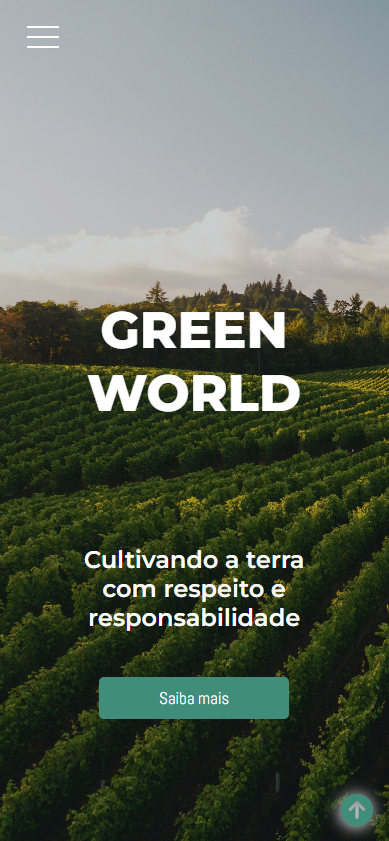

<h1><strong>GREEN WORLD</strong></h1>


|      MOBILE         |          DESKTOP       |
|:-------------------:|:-----------------------:
|||


[Clique aqui](https://green-world-senai.netlify.app/) para acessar o site. 

## **Objetivo**

Desenvolver um website para a empresa fictícia GREEN WORLD, criada por um dos grupos da turma de Administração do 1º semestre da nossa escola. Tudo foi pensado e definido para estar de acordo com os requisitos e necessidades dos mesmos.


## **Tecnologias Utilizadas**

- VUE
- HTML
- CSS
- Markdown
- Responsividade
- JavaScript
- Figma 
- Netlify

## **Figma**
Utilizando a ferramenta de design Figma, foi planejado o breakpoint. 
Segue o link: 

- [Link do Figma](https://www.figma.com/file/P82ULoZtzosFqokqeaVx9q/Green-World?type=design&node-id=116-1534&t=4RN6aZmE5jZweCx8-0)

## **Deploy**
A hospedagem do site foi feita no Netlify. Segue o link: 

- [Link do deploy no Netlify](https://green-world-senai.netlify.app/)


## **Autores**

| NOME                                                                                                                                                                                      |                                                     GITHUB                                                      |                                       FOTO                                       |
| :----------------------------------------------------------------------------------------------------------------------------------------------------------------------------------------- | :-------------------------------------------------------------------------------------------------------------: | :------------------------------------------------------------------------------: |
| <a href="https://github.com/BeatrizLandiCoelho"></a> |   <a href="https://github.com/BeatrizLandiCoelho"></a>   | </a> |
| <a href="https://github.com/HasegawaTaizou"></a> |   <a href="https://github.com/HasegawaTaizou"></a>   | </a> |
| <a href="https://github.com/camilapinh3iro"></a> |   <a href="https://github.com/camilapinh3iro"></a>   | </a> |
| <a href="https://github.com/FelipeFlorencio9"></a> |   <a href="https://github.com/FelipeFlorencio9"></a>   | </a> |


<!-- # teste

This template should help get you started developing with Vue 3 in Vite.

## Recommended IDE Setup

[VSCode](https://code.visualstudio.com/) + [Volar](https://marketplace.visualstudio.com/items?itemName=Vue.volar) (and disable Vetur) + [TypeScript Vue Plugin (Volar)](https://marketplace.visualstudio.com/items?itemName=Vue.vscode-typescript-vue-plugin).

## Customize configuration

See [Vite Configuration Reference](https://vitejs.dev/config/).

## Project Setup

```sh
npm install
```

### Compile and Hot-Reload for Development

```sh
npm run dev
```

### Compile and Minify for Production

```sh
npm run build
``` -->
